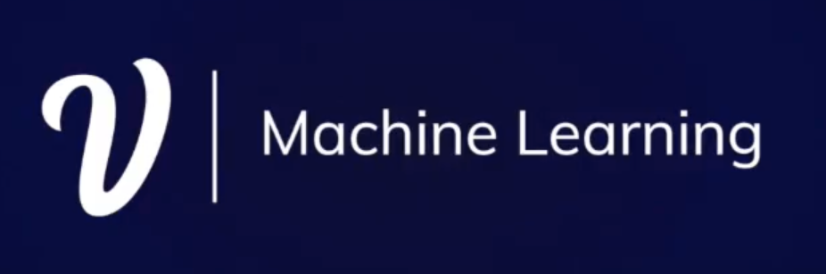
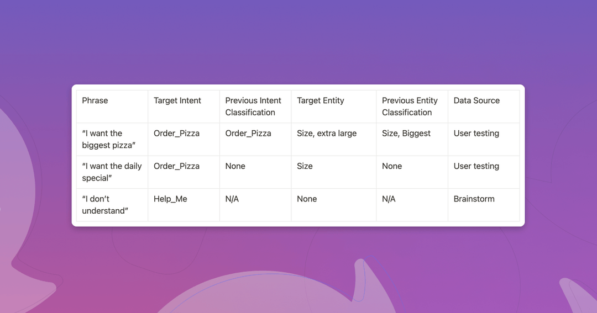

# Testing your NLU

In this repo you'll find a template for testing your NLU!
This repository is based on 
It uses a common pattern that can be adapted to other NLU providers by leveraging the interface provided under `src/interface.py`.

# Usage
Tutorial video provided [here](https://www.loom.com/share/83f26874d5e74429bce69a4406b406ef)
1. Run `pip install -r requirements.txt`
2. Create a voiceflow account at https://creator.voiceflow.com/
3. Upload the `examples/NLU_test_v1.vf`
4. Navigate to the "play" button and hit "Train Assistant". Wait until training completes to use a trained NLU.
5. Create your project dialogue manager key under the integrations tab.
6. Copy your dialogue manager key into the `examples/voiceflow.py` folder.
7. Run the `examples/voiceflow.py`
8. The `vf_test.compare_results()` function will fail
9. Update your `order_fries` and `help_me` intent in the exisiting file. Or you can upload `examples/NLU_test_v2.vf` (and create a new DM key) 

# Outputs
The example will generate two test result files and two plots, one for utterance tests and the other for entity tests under the examples folder.

# Resources for troubleshooting

- How to Create Your NLU testing Strategy Article(https://www.voiceflow.com/blog/how-to-create-your-nlu-testing-strategy)
- [Voiceflow Dialogue Manager API](https://developer.voiceflow.com/reference/overview)
- Any other questions? You can post on our [community page](https://community.voiceflow.com/home) or on this github repo.

# Coming soon
- [] Flow testing
- [] End to End Voiceflow integration
- [] Code walkthrough article
- [] Tests

